<p align="center">
  
</p>

<p align="center">
  <a href="https://github.com/Mr-kiran56"></a>
  <a href="https://linkedin.com/in/kiran-punna-b50774330"></a>
  <a href="mailto:kiranpunna58@gmail.com"></a>
  <a href="tel:+919381911235"></a>
</p>

---

## 👤 About Me

```sys
[sys@kiran ~]$ whoami
Software Engineer Intern @ IncuXai | Ex-AI/ML Intern @ Infosys Springboard | Google Student Ambassador
B.Tech CSE (Artificial Intelligence) @ AITS Rajampet | CGPA: 9.35
```

I am an **AI/ML Engineer and Full-Stack Developer** passionate about engineering real-time, high-throughput backend architectures, multimodal AI healthcare solutions, and enterprise multi-agent OS governance systems. 

* 🔭 **Current Role:** Engineering real-time web & mobile GovTech systems for police deployment and officer monitoring at **IncuXai**.
* 🤖 **AI/ML Focus:** Building production-grade RAG pipelines, GraphRAG search engines, LangGraph autonomous agent workflows, and explainable ML risk prediction models.
* 🎓 **Education:** Pursuing B.Tech in CSE (Artificial Intelligence) at **Annamacharya Institute of Technology & Sciences (AITS)** with a **9.35 CGPA**.
* 🏆 **Hackathons:** 1st Place winner at the **ATP Police AI Hackathon** for building a Smart Bandobast Monitoring System.
* 📜 **Research:** Accepted publication on *"An Intelligent Cloud Resource and Cost Optimization Framework using Machine Learning and Explainable AI"* (2027).

---

## 🛠️ Technical Skills

<table>
  <tr>
    <td width="30%"><strong>Programming Languages</strong></td>
    <td>
      
      
      
      
    </td>
  </tr>
  <tr>
    <td><strong>Backend & Web Dev</strong></td>
    <td>
      
      
      
      
      
      
      
    </td>
  </tr>
  <tr>
    <td><strong>Databases & Vector DBs</strong></td>
    <td>
      
      
      
      
      
      
    </td>
  </tr>
  <tr>
    <td><strong>Cloud, MLOps & Tools</strong></td>
    <td>
      
      
      
      
      
    </td>
  </tr>
</table>

---

## 🤖 AI / ML & Data Science Stack

```term
+-----------------------------------------------------------------------------------+
|  AI & LLM Frameworks  | PyTorch • Scikit-learn • LangChain • LangGraph • RAG      |
|                       | GraphRAG • Transformers • Sentence-BERT • OCR • LLMs      |
+-----------------------+-----------------------------------------------------------+
|  Data Science         | EDA • Feature Engineering • Pandas • NumPy • Matplotlib   |
|                       | Seaborn • FB Prophet (Time-Series Analytics)              |
+-----------------------------------------------------------------------------------+
```

---

## 🚀 Featured Projects

### 🛡️ [DutyGuard — Real-Time GovTech Command & Control Platform](https://github.com/Mr-kiran56)
> *High-Throughput Police Deployment & Officer Safety Monitoring System*

* **Async GPS Ingestion Pipeline:** Built high-throughput ingestion handling **~700 RPS** tracking **7,000+ officers** in real time with PostGIS geofencing, Redis deduplication, and batched WebSocket fan-out to supervisor dashboards.
* **Escalation & Safety Control:** Engineered a **4-level SOS escalation cascade** via recursive CTEs, an offline-first Capacitor mobile application with IndexedDB sync, and 6-role RBAC across police command hierarchies.
* 🛠️ **Tech Stack:** `Python` `FastAPI` `React.js` `PostgreSQL` `PostGIS` `Redis` `WebSockets` `Firebase FCM` `Capacitor` `IndexedDB`

---

### 🩺 [MediNutriAI — AI-Powered Healthcare Assistant](https://github.com/Mr-kiran56)
> *Multimodal Clinical Diagnostics & Explainable Diet Recommendation System*

* **Multimodal Medical RAG:** Engineered an end-to-end healthcare system using FastAPI, React, OCR, and RAG (LangChain, Sentence-BERT) to analyze medical reports and deliver explainable clinical insights.
* **ML Risk Prediction & Personalization:** Developed machine learning risk prediction models using Scikit-learn and automated personalized Indian diet plan generation based on patient diagnostics.
* 🛠️ **Tech Stack:** `Python` `FastAPI` `React.js` `OCR` `Scikit-learn` `Sentence-BERT` `LangChain` `RAG`

---

### ⚡ [SystemPilot AI — Enterprise Autonomous OS Governance & AI Workspace](https://github.com/Mr-kiran56)
> *Multi-Agent Orchestration & Fail-Safe Workspace Intelligence Platform*

* **Autonomous Multi-Agent Orchestration:** Engineered an enterprise OS governance platform leveraging **LangGraph**, zero-trust Human-In-The-Loop (HITL) safety controls, and Saga transaction rollbacks to ensure fail-safe workflow execution.
* **Telemetry & Hybrid GraphRAG:** Built a hybrid GraphRAG search engine and workspace telemetry system using ChromaDB, real-time WebSockets/SSE streaming, and **FB Prophet** for predictive system analytics.
* 🛠️ **Tech Stack:** `Python` `FastAPI` `React.js` `LangGraph` `ChromaDB` `PostgreSQL` `GraphRAG` `FB Prophet` `WebSockets` `SSE`

---

## 💼 Professional Experience

```term
┌── [IncuXai] Software Engineer Intern (Mar 2026 – May 2026)
│   ├── Engineered real-time web & mobile GovTech systems for police deployment and officer monitoring.
│   └── Integrated FastAPI, React, WebSockets, PostgreSQL/PostGIS, Redis, and Firebase.
│
├── [Infosys Springboard] AI/ML Intern (Nov 2025 – Feb 2026)
│   ├── Developed AI medical risk prediction system using OCR, BERT, RAG pipelines, and AI Doctor LLM.
│   └── Implemented MLOps workflows using DVC, GitHub Actions CI/CD, and AWS deployment.
│
└── [Google Student Ambassador] Campus Community Lead (2026)
    └── Organized AI & product development events, promoting Google AI tools & developer technologies.
```

---

## 🎓 Education & Research

### 📜 **Bachelor of Technology (B.Tech) in Computer Science & Engineering (Artificial Intelligence)**
* **Institution:** Annamacharya Institute of Technology & Sciences (AITS) — Rajampet, Andhra Pradesh
* **Duration:** 2023 – Present
* **CGPA:** **9.35 / 10.0**
* **Relevant Coursework:** Data Structures & Algorithms, Object-Oriented Programming, DBMS, Operating Systems, Machine Learning, Artificial Intelligence, Deep Learning, Natural Language Processing.

### 📄 **Publications & Research**
* **Title:** *"An Intelligent Cloud Resource and Cost Optimization Framework using Machine Learning and Explainable AI"*
* **Status:** Accepted for publication (2027).

---

## 🏆 Certifications & Achievements

* 🥇 **1st Place — ATP Police AI Hackathon:** Developed Smart Bandobast Monitoring System for patrol-time coordination, crowd management, and public safety.
* 🥈 **2nd Place — ML Mania Tech Fest:** Project Explore competition.
* 🏆 **Winner — University-Level Literary Competitions:** Recognized for technical communication & presentation excellence.
* 🌟 **Top 98.5 Percentile — Naukri Campus Young Turks Competition:** Ranked among top 98.5% nationally.
* 🚀 **Google Student Ambassador (2026):** Recognized for campus technology leadership and developer outreach.

---

## 📊 GitHub Statistics

<p align="center">
  
  
</p>

<p align="center">
  
</p>

---

## 📫 Connect With Me

<p align="center">
  <a href="https://linkedin.com/in/kiran-punna-b50774330">
    
  </a>
  &nbsp;
  <a href="https://github.com/Mr-kiran56">
    
  </a>
  &nbsp;
  <a href="mailto:kiranpunna58@gmail.com">
    
  </a>
  &nbsp;
  <a href="tel:+919381911235">
    
  </a>
</p>

<p align="center">
  <sub>Designed with 💻 &amp; ☕ for <b>Kiran Punna</b> | Terminal Theme GitHub Profile</sub>
</p>
